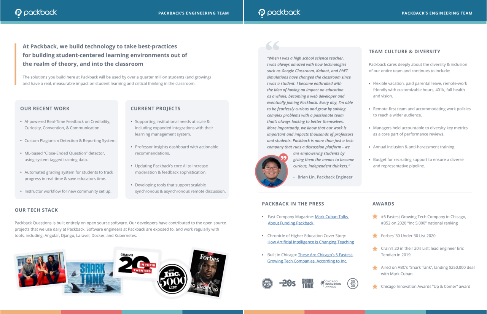

# Packback Engineering

At Packback, we build technology to take best-practices for building student-centered learning environments out of the realm of theory, and into the classroom. The solutions we build have been used by over a million students (and growing) and have a real, measurable impact on student learning and critical thinking in the classroom.

## Careers at Packback

### Open Positions

Visit the [Packback careers page](https://www.packback.co/company/careers/) to learn about our current job openings.

### Career Pathways

The [engineering ladder at Packback](careers/readme.md) provides a clear progression for career growth for all engineers. Whether specializing in individual contributorship or management, the ladder provides clear examples of the skills and behaviors needed for growth and promotion.

### Professional Development

Packback conducts performance reviews 3 times a year. In your review, you and your manager will discuss the wins and successes you've had since your last review as well as opportunities for growth and improvement.

In addition to performance reviews, everyone on the engineering team has [weekly 1-on-1s](1-on-1s.md) with their manager.

## Software Development at Packback

Packback Questions is built on open-source software using agile methodology (learn about a typical [sprint at Packback](the-sprint.md)). Our developers have contributed to the open-source projects that we use daily. Software engineers at Packback are exposed to, and work regularly with tools, including: Angular, Django, Laravel, Docker, and Kubernetes.

[Here](files/engineering-at-packback.pdf) is a PDF with more information about life on the engineering team at Packback.

<!-- To generate the png from the pdf, issue the following commands on a system with
imagemagick installed:

    convert -density 300 engineering-at-packback.pdf -flatten -resize 25% a.png
    montage a-0.png a-1.png -tile 2x1 -geometry +1+0 engineering-at-packback.png
-->

### Team Culture and Diversity

Working in the Education Technology space, we need to consider the needs of our audience's wide range of backgrounds and educational experiences. Packback believes it is an ethical necessity to build a diverse and inclusive team. Some of the ways we do that include:

- Remote-first team and accommodating work policies to reach a wider audience.
- Flexible vacation and working policy.
- 401k with employer match, full health and vision insurance.
- Education stipend for ongoing training and personal development.
- 8-12 weeks fully paid parental leave policy (for either parent welcoming a new child through birth or adoption, or to care for a family member in need).
- Managers are held accountable to diversity key metrics as a core part of performance reviews.
- Annual, company-wide inclusion & anti-harassment training.
- Budget for recruiting support to ensure a diverse and representative candidate pool.
