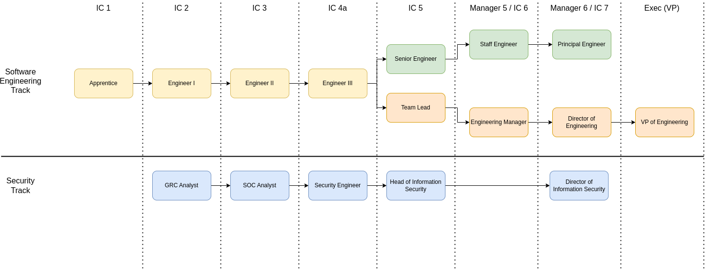

# Career Pathways

The general Software Engineer levels are common to all engineer paths. At the Senior Engineer level, roles split into different paths focused on management or contributorship. (Project management is integral to both paths). People on the management path will be expected to take on people and team management responsibilities. People on the contributor path will be expected to continue growing their breadth and depth of technical knowledge.

* [Software Engineer Path](software-engineer.md)
* [Managing Engineer Path](managing-engineer.md)
* [Technical Engineer Path](technical-engineer.md)

## Levels

Engineering leveling is not a checkbox exercise, that said, this document contains a representative set of behaviors that should be demonstrated by an engineer to be considered for promotion to the next level. Titles and level changes are lagging indicators of growth, driven by an individual personally choosing to demonstrate the behaviors of the next level of growth. Outside of formal reporting structure changes, higher levels are not "assigned" to an individual to disseminate greater responsibility; rather, the individual assumes the responsibility and their level changes to recognize their growth. To be considered a solid candidate for promotion, it will be considered necessary to demonstrate sustained mastery of the relevant skills.

All engineers at Packback should be positive and knowledgeable representatives for the Packback brand in professional interactions with both technical or non-technical individuals, and take personal responsibility to stay abreast of new technologies and their own education to make well-informed decisions and remain personally challenged. In addition to these shared expectations of all engineers, at a high-level the following descriptions of the levels can be applied:

* **Software Engineer**
    * [*Apprentice:*](software-engineer.md#apprentice) **Rapidly growing into a solid engineer**, works on a predetermined project with more senior resources, is hungry to learn, takes feedback graciously, finds a work-life balance.
    * [*Engineer I:*](software-engineer.md#engineer-i) **Builds defined features**, investigates and fixes bugs, writes tests, communicates progress, identifies blocking issues.
    * [*Engineer II:*](software-engineer.md#engineer-ii) **Owns a functional area.** Breaks large requests down into sub-tasks, gives higher-level status updates, writes test plans, takes operational responsibility. Sets measurable goals, and meets them. Reviews code changes, helps mentor new hires.
    * [*Engineer III:*](software-engineer.md#engineer-iii) **Takes undefined projects** and proposes both the possible functional solutions and the recommended technical solutions.
* **Managing Engineer**
    * [*Team Lead (Senior Engineer):*](managing-engineer.md#team-lead-senior-engineer) **Coaches a team on major projects.** Tracks the team's efficiency and quality of work. Champions process and leverages their experience to ensure the team hits their goals.
    * [*Engineering Manager:*](managing-engineer.md#engineering-manager) **Runs an engineering agile team.** Comfortable with management practice. Strong project managers. Track the team's efficiency and quality of work, assist in regularly adjusting processes and timelines to deliver high quality work.
    * [*Director of Engineering:*](managing-engineer.md#director-of-engineering) **Runs a "slice" of the engineering organization.** Grow the next generation of leadership at Packback. Manage other engineering managers. Strategically balance immediate and long-term product/business focused work with technical debt and strategic technical development. Guide the planning process for their team.
    * [*VP of Engineering:*](managing-engineer.md#vp-of-engineering) **Runs of multiple sectors of the engineering organization.** Works cross-functionally to solve problems for the product or company. Builds a health, robust engineering organization.
* **Technical Engineer**
    * [*Senior Engineer:*](technical-engineer.md#senior-engineer) **Owns the development for an entire product, or large project.** Champions process, writes tech specs and identifies risks before starting major projects. Sets standards. Goes out of their way to reduce complexity.
    * [*Staff Engineer:*](technical-engineer.md#staff-engineer) **Owns cross-team shared projects.** Works with leadership to choose new technologies, and promote culture/process. Has deep technical expertise in a business-critical area. Does serious research to evaluate and test options. Understands implications (and trade-offs) of reliability, scalability, operational costs, ease of adoption by the organization, recruiting, etc.
    * [*Principal Engineer:*](technical-engineer.md#principal-engineer) **"Chief architect" for our business.** They have significant strategic vision and can take a high-level 3-5 year plan for growth at a business level and translate that into a strategic technology roadmap.

### Senior Pathways

Along all senior pathways, expectations ramp up dramatically from level to level, because each successive level now represents a different job role than the previous level. It is possible to reach Senior Engineer as a focused, high-quality individual contributor. But beyond that expectations for the following levels indicate a level of broad leadership that requires more than generalized "thought leadership", but also the ability to engage groups of people within technology and outside of technology to make bigger and bigger things happen.

**Important notes about senior pathways:**

* Pathways within the engineering organization (management and technical paths) are considered--and will continue to be considered--equally valued regarding seniority and salary.
* The availability of more senior positions within these pathways is subject to the needs of the business. Even if an engineer is ready for a promotion, Packback cannot guarantee that such a position will be immediately available.

#### Opportunities for Leadership:

* Team leadership (typically management pathway)
* Project lead (both pathways)
* Backlog owner (typically technical pathway)
* Code owner / sign-off (typically technical pathway)
* Affinity group leader (typically technical pathway)

#### Changing Pathways

If they haven't already decided on a pathway, engineers should use the Senior Engineer level to explore which pathway best suits their skills and goals. If a Senior Engineer embarks down one pathway only to discover that it is not the best fit for them, they may change to a different path (assuming a position is available) without any loss of compensation or seniority. If this change happens beyond the Senior Engineer level, Packback will do it's best to accommodate a change but will need to take qualifications and experience into consideration (e.g. a VP may not necessarily be qualified to become a Principal Engineer.)

## Example Accomplishments by Level

### Software Engineer

* Apprentice engineer
    * Only [allow admins and post authors](https://github.com/packbackbooks/questions/pull/4033) to delete a post. This PR changes backend permissions, restricting the ability to permanently delete a post to admins and the post author only. (Previously, professors and TAs could also delete posts.)
    * Show the [same text for progress indicators](https://github.com/packbackbooks/questions/pull/4014) on desktop and mobile. This PR standardizes the language presented to desktop and mobile users in our component that displays a user's progress through a series of steps. (Previously, it hid useful data from mobile users, which is an accessibility failure.)
* Engineer I
    * Create an endpoint for [getting grading intervals](https://github.com/packbackbooks/questions/pull/4034). This PR adds a new endpoint for fetching a collection of grading intervals belonging to a community. It has full test coverage and updates API documentation.
    * Create a component to [list grading report deadlines](https://github.com/packbackbooks/questions/pull/3986). This PR adds a new component to list assignment deadlines for community grading. It includes automated testing, is WCAG AA compliant, and makes minor updates to E2E tests.
* Engineer II
    * Plan the [technical implementation](https://packback.atlassian.net/wiki/spaces/QUESTIONS/pages/652083360) to allow a professor or TA to specify a section when uploading their roster. This plan addresses testing strategies and edge cases, defines changes to the API contracts, specifies a release strategy for the feature, and breaks the work out into clear, concise tickets.
    * Modifying the edit grading report endpoint to [allow users to update assignments](https://github.com/packbackbooks/questions/pull/3974). This PR includes conditional validation for user-submitted data and includes robust test coverage.
* Engineer III
    * Plan the project to [update checkout to support Packback Instruct pricing](https://packback.atlassian.net/wiki/spaces/Instruct/pages/734691345). 
    * When a user uploads a roster with invalid rows, let them [download a CSV of invalid rows with the reason they're invalid](https://github.com/packbackbooks/questions/pull/4046). This PR adds complex validation for large data sets. Comprehensive test coverage and manual testing are a given.

### Managing Engineer

* Team Lead (Senior Engineer)
    * Implement a way to accurately track team velocity
    * Technical accomplishments listed for Senior Engineer
* Engineering Manager
    * Hire a new member of the team
    * Technical accomplishments listed for Senior Engineer
* Director of Engineering
    * Standardize the collection and tracking of metrics across teams
    * Hire and build out a new engineering team
    * Technical accomplishments listed for Staff Engineer
* VP of Engineering
    * Implement a hiring process create a talented, well-qualified, diverse engineering organization
    * Technical accomplishments listed for Principal Engineer

### Technical Engineer

* Senior Engineer
    * Plan the project to [pass grades back to an LMS via LTI](https://packback.atlassian.net/wiki/spaces/GBS/pages/615284737). This project relies on implementing a poorly-documented third-party system to update Packback grades in the Professor's course in the LMS. It documents complex relationship management, defines necessary modifications to the database and API contracts, and breaks work out into multiple stages for delivery.
    * [Split our frontend grading UI into multiple steps.](https://github.com/packbackbooks/questions/pull/3927) This PR is a significant refactor of a critical user flow. It breaks our existing form for configuring a community's grading deadlines and rubric into two separate steps. The form contained complex validation logic that needed to be separated out. It also updates E2E tests.
* Staff Engineer
    * Plan and implement an [upgrade to our Kubernetes cluster that minimizes user impact](https://packback.atlassian.net/wiki/spaces/RUT2/pages/246677505). An upgrade to our Kubernetes cluster was necessary but would mean some inevitable downtime. This plan outlined the preparatory work necessary to ensure minimal disruption, as well as coordinating a team-wide effort to facilitate the process.
    * [Merge a collection of disparate, highly-dependent microservices into a monolith](https://github.com/packbackbooks/questions/pulls?page=1&q=is%3Apr+author%3AEricTendian+monolith) with limited disruption to other developers. This series of PRs merged three highly-dependent Laravel APIs into a single application. The change was made in a way that avoided merge conflicts, as all three APIs were under active development by other engineers.
* Principal Engineer
    * Plan and implement CI/CD and containerization for our platform. This project involved containerizing all our services, building out our entire software ecosystem as infrastructure-as-code, and creating an intelligent CI pipeline to test and deploy changes in under 60 minutes.
