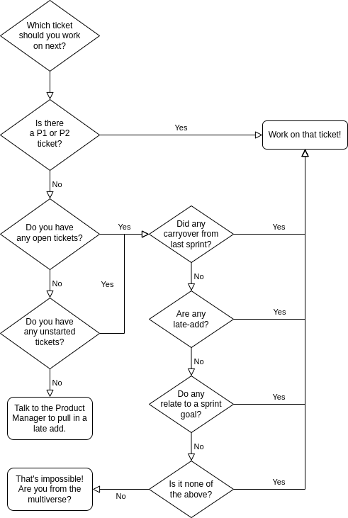

# Becoming a better engineer

Growth is hard, and becoming a better engineer takes time and practice. When trying to become a better engineer, it's not always clear where you should focus your energy or what you can do to solve the challenges you face. Thankfully, you're not alone. Your peers are facing similar challenges.

This guide addresses common challenges that engineers face during their growth path and offers strategies and behaviors that can help them overcome these challenges.

## Team productivity

### Prioritizing work

One of the primary goals of agile methodology is ensuring that the most important work gets done first, so deciding which tickets to prioritize is essential. Tickets should generally be worked on in the following order:

1. P1 or P2 tickets
2. Open tickets*
3. Unstarted tickets*

*When you have multiple tickets that fall into either the open or unstarted category, use the following priorities:

1. Carryover tickets
2. Late-add tickets
3. Sprint goal tickets
4. Other tickets

Confused? Hey look, a handy flow chart!

### Accurately planning work

- Use retrospectives to identify and solve common problems in estimating tickets.
- Talk to the product team early and often. Understanding the requirements is key to planning work accurately.
- Collaborate with the product team if you have ideas for how to improve and/or simplify the work. They are aligned to our goal of delivering high-quality work quickly, so suggestions are welcomed.
- Some work is very difficult to plan by just looking at it. Make prototypes or use research tickets to help gain a better understanding of the problem and identify potential issues.
- Ask: What are some non-obvious interactions that might cause problems?
- In planning meetings, get everyone to speak, so everyone is able to share their unique perspective. There might be long periods of silence while folks are thinking, and that's ok.

### Handling grossly misestimated tickets

- Work with the backlog owner to reduce the scope and update the DoD.
- Create additional tickets to encompass the remaining work.
- Working with the backlog owner, determine whether the additional tickets should be pulled into the current sprint or prioritized for an upcoming sprint.
- Reflect on how we could have estimated this ticket better. Advocate for ways to improve estimation in sprint retrospective.

## Troubleshooting individual productivity

### Consistently low velocity (typically junior)

Low velocity is usually a symptom of either time management issues or taking tickets that are too difficult.

- Limit work-in-progress. You should never have more than 3 tickets open at a time. Ideally you should only ever 1 in progress and 1-2 in PR. Focus on one thing at a time to reduce the need for context switching.
- Use the guide for [prioritizing work](#prioritizing-work) to decide what you should be working on.
- Take small, well-defined tickets. Avoid 3-point and limit 2-point tickets, as these usually contain large areas of uncertainty.
- Before starting any ticket, make a plan for how you will accomplish the ticket. Present that plan to a more senior engineer and get feedback.
  - For larger tasks, repeat this process daily, revising your plan as you go along.
- If you struggle with rabbit-holing, set a repeating timer for 30 minutes. When the timer goes off, if you don't feel like you're making meaningful progress, reach out for help.
  - Once you are consistently making progress, increase the timer interval until you feel confident that you can notice when you're stuck and need help.

As a manager of a team member struggling with low velocity, begin by asking open-ended questions to get the developer to reflect on why they've been struggling to deliver tickets.

- How does the person feel about their tickets?
  - Can they identify any trends in the problems they encounter with tickets?
- How do they feel asking for help?
  - What prevents them from noticing that they should ask for help?
  - What prevents them from reaching out for help when they notice they're stuck?

### Unpredictable / highly variable velocity (typically mid-level)

When a developer's productivity fluctuates dramatically, this is often a symptom of taking on highly complex work relative to their level.

- Pair when planning for tickets outside your expertise. Talk through your proposed solutions with another engineer proficient in that area to make sure your plan of attack is sound before devoting too much time to it.
  - The same applies when you get stuck on a problem with multiple possible solutions.
- Learning complex problem-solving takes time; keep at it. Unfortunately, the long term solution to this problem is to just keep practicing until you gain mastery over new skills. Keep challenging yourself, just make sure you don't slip into consistently low velocity.

### Bus-factor 1 (typically senior)

What would happen to the team if you got hit by a bus? When a developer is the only person who is capable of performing a task, this is a symptom of knowledge siloing.

- **Document everything.** Create documentation explaining how a system or process works.
- **Create an ownership rotation.** Train another developer to a service or process. Let them handle the majority of responsibilities related to that service for the next several months. Once a developer gains competency, begin cross-training the next person.
  - **Cross-train technical skills.** Stop taking tickets related to a service, and instead devote time to pairing with the developer until they are confident to maintain it themselves. Use this to drive improvements to documentation.
  - **Designate an alternate.** Train an alternate on how to operate a process in your absence. Supervise until you feel comfortable letting them operate it independently. For example, attend a meeting but let them run it; later, stop attending the meeting to ensure they can run it without you.
- **Grant access and permissions.** Ensure that at least one other person has proper access and permissions to all services and vendor accounts within the organization.
- **Take a vacation!** Then observe what happens when you go on vacation. Use single points of failure that came up as a way to guide building redundancy.
