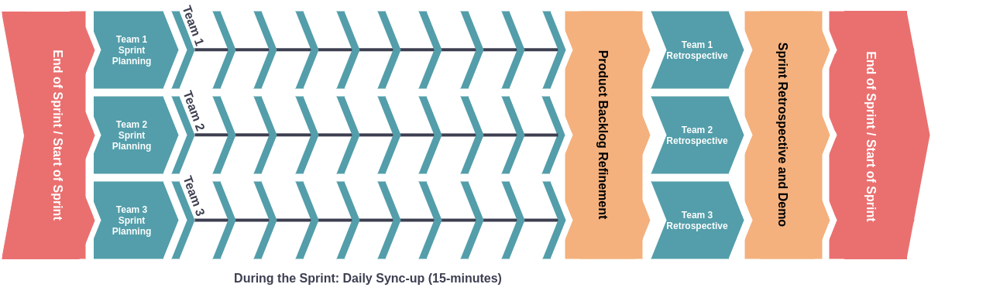

# How Does Packback Engineering Work?

Building a platform isn't easy! Packback engineering has the goal of executing quickly and reliably on new features, while simultaneously prioritizing the security, accessibility, reliability and performance of the Packback platform.

This page contains a description of how the engineering teams at Packback keep their work organized, keep different development teams in sync with each other and keep engineering in sync with its partners in the product team. The rest of this document breaks this down in, but at the highest level, Packback engineering does *agile software development*, using the tools of *continuous delivery* to ensure rapid and reliable delivery of code to users.

* "Agile": Packback engineering follows an agile software development process, where work is planned and executed in two-week "sprints".
* "Continuous Delivery": Packback engineering deploys its platform multiple times per day, and code is tested and released to production entirely automatically after a developer merges code into the Packback codebase

Engineering teams at Packback divide their work into sprints. To manage this work across multiple teams, we use the [Large Scale Scrum Framework](https://less.works/less/framework) (or LeSS).

## What Goes Into a Sprint?

Engineering runs a few standard meetings every sprint

Despite the image above looking pretty busy, there are very few regular meetings for engineers. On nine out of ten working days, the only scheduled meeting is a 15-minute sync up with your team members.

From left-to-right on the diagram, the meetings that happen each sprint are as follows

### Team sprint planning

This meeting marks the start of a new sprint and is when you meet with the members of your team to

* align on team-level goals for the new sprint
* resolve any outstanding questions about planned work
* create a plan to meet the sprint goals (who will do what?)

**Who participates?** The members of an individual team.

**When does this meeting happen?** At the start of each sprint, directly after the sprint retrospective and demo.

### Daily sync-up

This meeting (elsewhere referred to as stand up or scrum) should last no more than 15 minutes. It happens daily, at a time chosen to be convenient for all timezones represented on a team. The purpose of sync-up is to coordinate within the team (and, if necessary, across teams) to ensure they meet their sprint goals.

Each team member should answer:

* What did you do yesterday?
* What will you do today?
* Are you running into any blockers or problems?

At the end of sync up, we also ask if anyone has noticed any problems or opportunities for improvement. Sharing an opportunity doesn't mean you will be responsible for implementing it, but ensures that observations and ideas are tracked so that they can be discussed team-wide during retrospectives.

**Who participates?** The members of an individual team. Additionally, members of other teams may join and observe to facilitate communication and cross-team collaboration.

**When does this meeting happen?** Daily, usually around midday.

### Division sprint planning

The Division sprint planning meeting is how the different teams at Packback engineering remain in sync with each other, and is where team leads and product managers collaborate to ensure that engineering is working on the *correct* tickets. The goal of division sprint planning is to:

* identify which tickets should be estimated next sprint
* surface questions, problems, and blockers for the selected tickets
* determine which teams will be responsible for the selected tickets

**Who participates?** Product managers, team leads, and certain backlog owners. Teams may decide who to send to this meeting, such as a project lead, or anybody who has information relevant to upcoming projects.

**When does this meeting happen?** Towards the end of the sprint before individual team scrums.

### Team scrum

Tickets are assigned to teams as a part of division sprint planning. The goal of team scrum is then to:

* estimate tickets selected for next sprint
* surface questions, problems, and blockers for the selected tickets
* determine sprint goals for the upcoming sprint

**Who participates?** The members of an individual team.

**When does this meeting happen?** The day before the end of the sprint.

### Team retrospective

The goal of team retrospective is to:

* discuss any opportunities for improvement mentioned during the sprint
* discuss any other problems or opportunities for improvement
* make a plan to implement opportunities that the team decides are worthwhile
* record any tickets that took longer than expected and the reason did (this data will be aggregated for later use)

**Who participates?** The members of an individual team.

**When does this meeting happen?** At the end of the sprint, just before the sprint retrospective and demo.

### Sprint retrospective and demo

This meeting marks the end of a sprint. The goal of sprint retrospective is to:

* discuss any opportunities from team retrospectives that would be helpful to discuss at an organizational level
* give shout outs to teammates for exemplary performance

The goal of sprint demo is for each team to share with the rest of the organization:

* what they accomplished last sprint
* their sprint goals for next sprint

**Who participates?** All members of the Engineering org.

**When does this meeting happen?** At the very end of the sprint on Tuesday afternoon.
